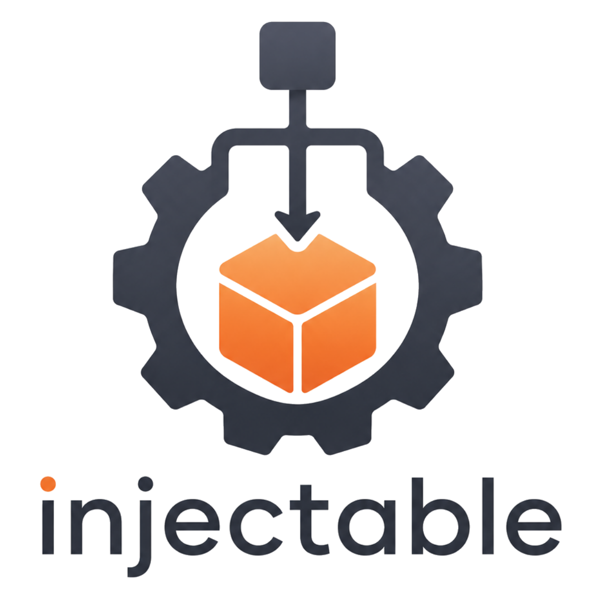

# injectable

<div align="center">

</img>
</div>

A compile-time dependency injection framework for Rust, inspired by Axum's typed extractor model.

Current docs target `injectable` `0.2.x` on Rust `1.86+`.

- Repository: <https://github.com/jymchng/injectable>
- Guide index: [guides/README.md](guides/README.md)
- AI skills index: [skills/README.md](skills/README.md)

```rust
use injectable::prelude::*;

#[injectable]
#[derive(Default)]
struct Database;

#[injectable]
struct UserService {
    db: Inject<Database>,
}

impl UserService {
    fn get_user(&self, id: u32) -> String { format!("User #{id}") }
}

#[tokio::main]
async fn main() {
    let container = Container::builder().build().await.unwrap();
    let svc = container.resolve::<UserService>().await.unwrap();
    println!("{}", svc.get_user(1));
}
```

## Why Injectable?

**No runtime reflection.** Dependency chains are encoded into generated `Provider` impls at compile time. The resolved type is always statically known — no `TypeId` lookups, no `Box<dyn Any>` in the hot path.

**Axum-compatible.** `Inject<T>` implements `FromRequestParts`, so dependencies drop into Axum handler signatures exactly like `Query<T>` or `Path<T>`.

**Fail early.** Circular dependencies, missing registrations, and scope mismatches are caught at `Container::builder().build()` — before any request is served.

**You can still test without the container.** Constructors are plain Rust functions. Call them directly in unit tests with test doubles.

---

## Quick Start

```toml
[dependencies]
injectable = { version = "0.2", features = ["axum"] }
tokio     = { version = "1", features = ["full"] }
```

Import everything via the prelude:

```rust
use injectable::prelude::*;
```

---

## Core Concepts

### Types You Own — `#[injectable]` on struct

```rust
use injectable::prelude::*;

#[injectable]
#[derive(Default)]
pub struct Cache;

#[injectable]
#[derive(Default)]
pub struct Database;

// Field injection: Inject<T> fields are auto-wired.
// Arc<T> and plain T fields require an explicit #[injectable(inject)].
#[injectable]
pub struct UserRepository {
    db:    Inject<Database>,    // auto-injected — no annotation needed
    cache: Inject<Cache>,       // auto-injected
}
```

### Types You Don't Own — `DynProvider`

Register closure-based providers for third-party types at container build time:

```rust
let container = Container::builder()
    // Synchronous — no async, no dependencies
    .register(DynProvider::sync(|| Ok(reqwest::Client::new())))

    // Async — connect, load, warm up
    .register(DynProvider::new(|| async {
        Ok(sqlx::SqlitePool::connect("sqlite:./app.db").await?)
    }))

    // Context-aware — depends on other injectable types
    .register(DynProvider::with_ctx(|ctx| async move {
        let config: Inject<AppConfig> = ctx.extract().await?;
        Ok(sqlx::SqlitePool::connect(&config.database_url).await?)
    }))

    .build()
    .await?;
```

Inside `DynProvider::with_ctx`, use `ctx.extract::<Inject<T>>()` (scope-safe) to resolve
injectable types, and `ctx.resolve_external::<T>()` to resolve other `DynProvider`-registered types.

### Constructor Injection — `#[injectable]` on impl block

Full control over construction while keeping the public signature clean:

```rust
use injectable::prelude::*;

// AppConfig is your own type — Injectable, singleton by default.
#[injectable]
pub struct AppConfig { pub database_url: String }

async fn make_pool(_ctx: &ResolveContext) -> Result<sqlx::SqlitePool, sqlx::Error> {
    sqlx::SqlitePool::connect("sqlite:./app.db").await
}

pub struct EmailService {
    pool:   sqlx::SqlitePool,
    config: Arc<AppConfig>,
    retry:  u32,
}

#[injectable]
impl EmailService {
    #[injectable(ctor)]
    pub async fn new(
        #[injectable(inject(use_factory_async = self::make_pool))] pool: sqlx::SqlitePool,
        #[injectable(inject)] config: Arc<AppConfig>,   // Injectable type — receives singleton Arc
    ) -> Self {
        Self { pool, config, retry: 3 }     // retry set manually
    }
}
```

`#[injectable(inject)] param: Arc<T>` requires `T: Injectable` — it uses the singleton cache and returns the
same `Arc` on every resolution. External types (sqlx, reqwest, etc.) are not `Injectable`;
use `#[injectable(inject(use_factory_async/sync = path))]` for those instead.

Parameter rewriting rules:

| Declared type | Annotation | What you receive |
|---|---|---|
| `Inject<T>` | none | `Inject<T>` — `Arc<T>` wrapper; `T` must be `Injectable` |
| `Arc<T>` | `#[injectable(inject)]` | Singleton `Arc<T>`; `T` must be `Injectable` |
| `T` (Clone) | `#[injectable(inject)]` | Owned clone of singleton `T`; `T` must be `Injectable` |
| External type | `#[injectable(inject(use_factory_async/sync = path))]` | `T` from factory |

### Lifecycle Hooks

```rust
use injectable::prelude::*;

pub struct ConnectionPool { /* ... */ }

#[injectable]
impl ConnectionPool {
    #[injectable(ctor)]
    pub fn new() -> Self { /* ... */ }

    #[injectable(post_construct)]       // runs after construction
    pub async fn warm_up(&self) -> HookResult {
        println!("opening connections");
        Ok(())
    }

    #[injectable(pre_destruct)]         // runs during container.shutdown()
    pub async fn drain(&self) -> HookResult {
        println!("closing connections");
        Ok(())
    }
}
```

### Axum Integration

```rust
use injectable::axum::AxumState;

async fn get_user(
    Path(id): Path<u64>,
    Inject(svc): Inject<UserService>,    // resolved per-request
) -> Json<User> {
    Json(svc.get(id).await.unwrap())
}

let state = AxumState::new(container);
let app   = Router::new()
    .route("/users/:id", get(get_user))
    .with_state(state);
```

---

## The `Inject<T>` Wrapper

`Inject<T>` wraps `Arc<T>` and implements `Deref<Target = T>`. It is the primary field and parameter type for shared dependencies.

```rust
let svc: Inject<UserService> = container.resolve().await?;

svc.some_method();          // via Deref
let arc = svc.arc();        // clone the Arc
let arc = svc.into_inner(); // consume Inject<T>, take Arc<T>

// Destructuring pattern
let Inject(arc) = svc;      // arc: Arc<UserService>
```

### Optional Dependencies

```rust
#[injectable]
pub struct Notifier {
    sms: Option<Inject<SmsClient>>,    // None if not registered
}

impl Notifier {
    pub fn send(&self, msg: &str) {
        if let Some(s) = &self.sms { s.send(msg); }
    }
}
```

---

## Validation at Build Time

```
Container::builder().build().await
    │
    ├── Collect all GraphNode entries via inventory
    ├── Validate: duplicate nodes
    ├── Validate: missing dependencies (simple names only; path-qualified names are external)
    ├── Validate: circular dependencies (full chain reported)
    ├── Validate: scope mismatches
    └── Build ResolveContext → Container
```

Error messages are precise:

```
dependency graph validation failed:
  - circular dependency detected: OrderService -> UserService -> OrderService
  - `InvoiceService` depends on `PdfRenderer`, which is not registered
```

---

## Feature Flags

| Flag | Description |
|---|---|
| `axum` | `Inject<T>: FromRequestParts`, `AxumState`, `InjectableRejection` |

---

## Guides

| # | Guide |
|---|---|
| 01 | [Getting Started](guides/01-getting-started.md) |
| 02 | [Field Injection with `#[injectable]`](guides/02-field-injection.md) |
| 03 | [Constructor Injection with `#[injectable(ctor)]`](guides/03-constructor-injection.md) |
| 04 | [External Types with `DynProvider`](guides/04-external-types.md) |
| 05 | [Lifecycle Hooks](guides/05-lifecycle-hooks.md) |
| 06 | [The `Inject<T>` Wrapper](guides/06-inject-wrapper.md) |
| 07 | [Axum Integration Basics](guides/07-axum-basics.md) |
| 08 | [Axum Custom State](guides/08-axum-custom-state.md) |
| 09 | [Axum Middleware and Auth Guards](guides/09-axum-middleware.md) |
| 10 | [Testing Injectable Services](guides/10-testing.md) |
| 11 | [Config from Environment Variables](guides/11-config-from-env.md) |
| 12 | [Dependency Graph Validation](guides/12-dependency-graph.md) |
| 13 | [Realistic Axum Web App](guides/13-axum-realistic-app.md) |
| 14 | [Optional Dependencies and Layered Registration](guides/14-optional-deps.md) |
| 15 | [Organizing a Large Application](guides/15-large-app-organization.md) |
| 16 | [Development and Release Workflow](guides/16-development-and-release.md) |
| — | [3 Ways to Inject External Types](guides/3-ways-to-inject-external-types.md) |

See [guides/README.md](guides/README.md) for a categorized guide index and
contributor-oriented release/documentation notes.

---

## Project Links

| Resource | Link |
|---|---|
| Homepage | <https://github.com/jymchng/injectable> |
| Repository | <https://github.com/jymchng/injectable> |
| Development + release guide | [guides/16-development-and-release.md](guides/16-development-and-release.md) |
| AI skills catalog | [skills/README.md](skills/README.md) |

---

## Running the Examples

```sh
# Basic field injection
cargo run --example 01_basic_field_injection

# Constructor injection patterns
cargo run --example 02_constructor_injection

# External types (reqwest::Client, sqlx::SqlitePool)
cargo run --example 03_external_types

# Lifecycle hooks: post_construct + pre_destruct
cargo run --example 04_lifecycle_hooks

# Dependency graph inspection
cargo run --example 05_dependency_graph

# Scopes
cargo run --example 06_scopes

# Axum integration (requires axum feature)
cargo run --example 07_axum_integration --features axum

# Realistic web app: config + sqlx + services + axum
cargo run --example 08_realistic_web_app --features axum

# Weather API with sqlx + reqwest + axum
cargo run --example 09_weather_api --features axum

# Multi-service weather + users app
cargo run --example 10_weather_users_api --features axum

# URL shortener with full CRUD
cargo run --example 11_url_shortener --features axum
```

---

## License

MIT OR Apache-2.0
